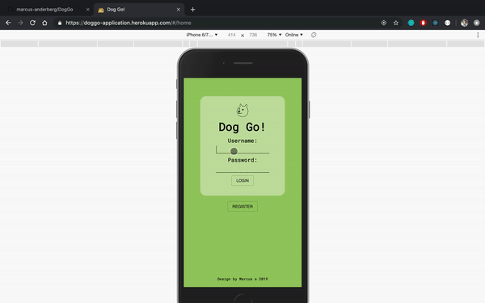
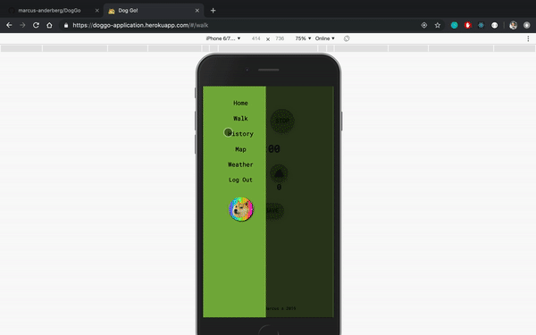
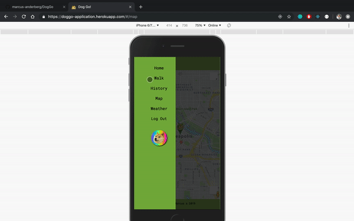

## https://doggo-application.herokuapp.com/

## Setup Instructions
* Run `npm install`

* Start postgres if not running already by using `brew services start postgresql`
* Run `npm run server`
* Run `npm run client`
* Navigate to `localhost:3000`

